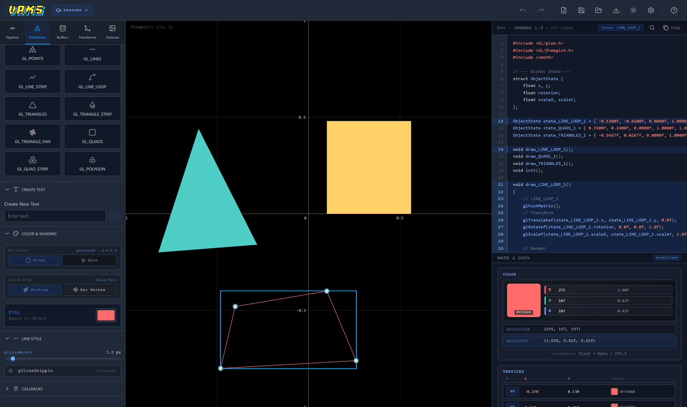
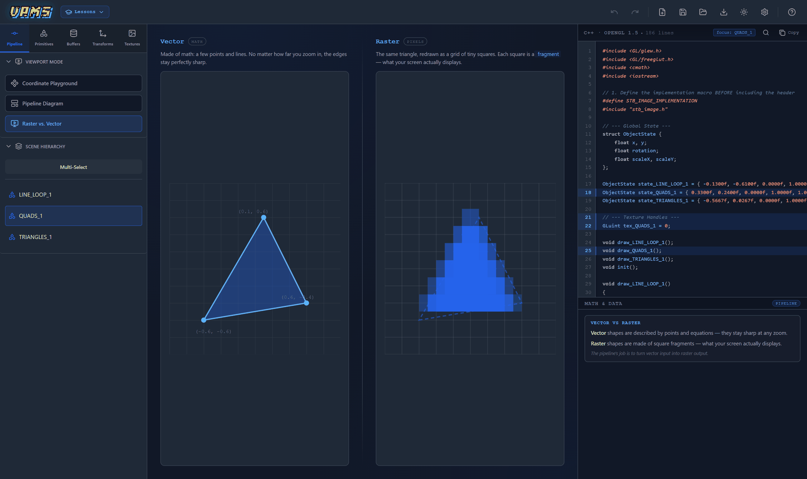
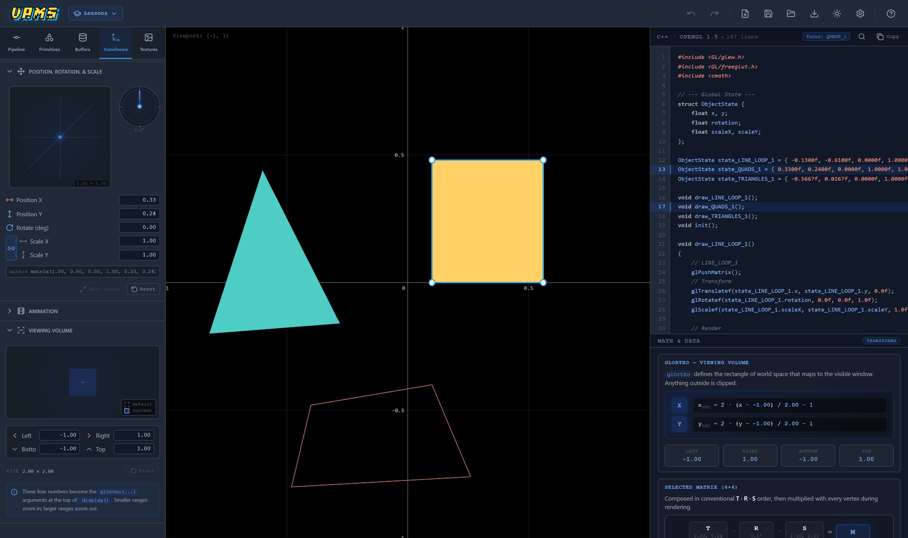
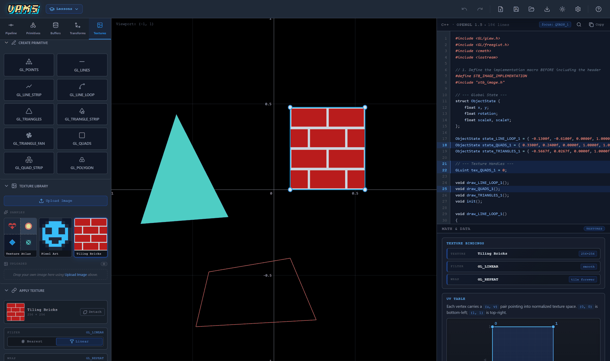
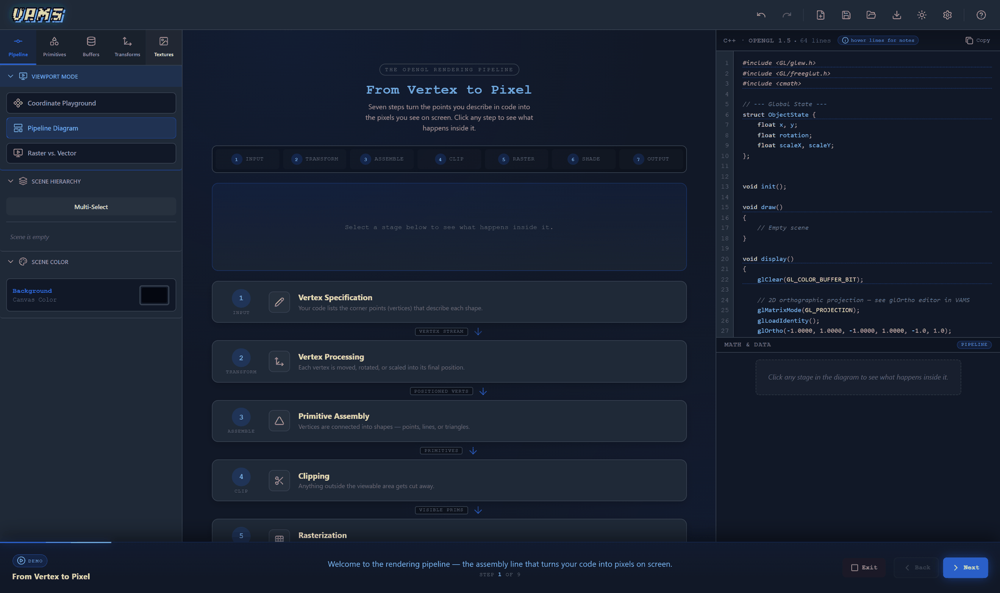

<div align="center">

# VAMS — Visual Animation Modeling Simulator

**A GUI-only teaching simulator for OpenGL 1.5.**
Students build 2D scenes by hand and watch the corresponding C++ OpenGL code write itself, line by line.

[](https://github.com/mkepg/Panic-TheCisco-VAMS/actions/workflows/ci.yml)
[](LICENSE)




</div>

---

## The problem

Students learning OpenGL 1.5 hit two walls at once. They have to reason about an invisible state machine — what is bound, what is on the matrix stack, what the current colour is — while simultaneously fighting a C++ toolchain that punishes every typo with a linker error. The graphics concept and the plumbing are tangled together, so a student who misunderstands `glOrtho` looks exactly like a student who forgot to link GLEW.

VAMS separates them. The student never writes code and never compiles anything. They manipulate a scene through a GUI, and VAMS continuously shows three synchronized views of what they just did:

| View | What it shows |
| --- | --- |
| **Canvas** | The scene, drawn live. |
| **Code panel** | The read-only C++ OpenGL 1.5 program that would produce it. |
| **Math panel** | The arithmetic underneath — NDC mapping, colour conversion, the composed 4×4 matrix. |

Every mutation flows one way: student action → application state → all three views recompute. The views never write back. Because the code is *generated* from scene state rather than typed, it is always correct and always in sync — which makes it a reliable thing to read and learn from.

## What it does

VAMS is organised as five curriculum sections, each pairing free authoring with guided lessons and checked exercises.

**Pipeline** — an interactive walkthrough of the seven stages from vertex to pixel, a normalized-device-coordinate playground, and a raster-versus-vector comparison.



**Primitives** — place all ten GL primitive types vertex by vertex, switch between `glColor3f` and `glColor3ub` colour emission, style lines with width and stipple, and register GLUT callbacks.

**Buffers** — vertex arrays, VBOs, and memory layout, with GLEW-backed buffer code generation.

**Transforms** — translate, rotate, and scale objects and watch the `T · R · S` composition build the 4×4 matrix that multiplies every vertex. The viewing-volume editor makes `glOrtho` tangible.



**Textures** — attach images to geometry, edit UV rectangles directly, and see how `GL_LINEAR` versus `GL_NEAREST` and `GL_REPEAT` versus clamping change the result.



### Lessons and exercises

Lessons are authored as structured data rather than code strings, and drive the scene through the same mutation API the GUI uses — so every lesson step is something a student could also have done by hand. Exercises add a `successCheck`, a pure function over scene state that decides whether the student met the goal.



## Getting started

Requires **Node.js 20+** and a browser with WebGL support.

```bash
git clone https://github.com/mkepg/Panic-TheCisco-VAMS.git
cd Panic-TheCisco-VAMS
npm install
npm run dev
```

Vite prints a local URL, usually <http://localhost:5173>.

| Script | What it does |
| --- | --- |
| `npm run dev` | Start the dev server with hot reload. |
| `npm run build` | Type-check with `tsc -b`, then build to `dist/`. |
| `npm run preview` | Serve the production build locally. |
| `npm run lint` | Run ESLint across the project. |
| `npm test` | Run the full Vitest suite once. |
| `npm run test:watch` | Re-run tests on change. |
| `npm run test:coverage` | Run tests and write a coverage report to `tests/reports/coverage/`. |

## Architecture

VAMS follows [Feature-Sliced Design](https://feature-sliced.design/). Layers may only import downward, which keeps the 23 features independent of one another and makes each one readable on its own.

```
src/
├── app/        Application shell, routing between panels, global styles
├── widgets/    Composite UI: the canvas, and the top/left/right layout regions
├── features/   23 self-contained capabilities — code-generation, lesson-engine,
│               textures, object-transform, buffers, animation-preview, …
├── entities/   Domain models: scene (objects, viewport, interaction) and project
├── core/       Zustand store slices, shared types, the animation clock
└── shared/     The matrix engine, hooks, reusable UI primitives, design tokens
```

The pieces worth knowing about:

- **State** is a [Zustand](https://zustand.docs.pmnd.rs/) store split into slices (scene, viewport, interaction, history, lesson, runtime, callbacks), with [Immer](https://immerjs.github.io/immer/) for ergonomic immutable updates and snapshot-throttled undo/redo.
- **Code generation** (`features/code-generation`) is a pure function from scene state to a C++ source string, split into per-concern emitters for state, buffers, textures, and render calls. Being pure is what makes it exhaustively testable.
- **Rendering** uses [PixiJS 8](https://pixijs.com/) on the canvas. The renderer draws the scene; it never owns it.
- **UI** is [Preact](https://preactjs.com/) with `preact/compat` aliased over React, so the React ecosystem works while the bundle stays small.

Written in TypeScript under `strict`, with `noUnusedLocals`, `noUnusedParameters`, and `noFallthroughCasesInSwitch` all enabled.

## Testing

250 tests across 24 files, all passing. The suite implements the verification programme in **Chapter 3, §3.10** of the manuscript, and each test carries a stable identifier of the form `{SUITE}-{MODULE}-{NN}` so results map back to the thesis tables.

| Suite | Files | Maps to | Covers |
| --- | --- | --- | --- |
| `tests/black-box/` | 10 | Table 12 | Behaviour through the public store API — primitive creation, transforms, hierarchy, code generation, C++ validity, lessons, persistence. |
| `tests/white-box/` | 11 | Table 13 | Internals — store slices, the matrix engine, scene-graph traversal, lesson internals, error handling. |
| `tests/algorithm/` | 3 | §3.10.3 | The three core algorithms, checked against independent reference implementations. |

```bash
npm test                 # run everything
npm run test:coverage    # regenerate tests/reports/coverage/
```

Algorithm validation deliberately avoids testing the implementation against itself: `tests/helpers/matrix.ts` is a separate reference implementation of the affine-matrix engine, used as the gold standard for ALG-1. Manual verification procedures that cannot be automated — compiling the exported C++, cross-browser checks — are written up in `tests/reports/`.

See [tests/README.md](tests/README.md) for the full suite breakdown.

## Documentation

- [docs/product-plan.md](docs/product-plan.md) — the authoritative product plan: what VAMS is, the core constraints, and the staged curriculum build-out.
- [tests/README.md](tests/README.md) — test suite layout and identifier scheme.

## Academic context

This project is the software artifact of an undergraduate thesis.

- **Degree programme:** Bachelor of Science in Computer Science, with Specialization in Software Engineering
- **Institution:** FEU Institute of Technology
- **Adviser:** Elisa V. Malasaga
- **Academic year:** 2025–2026

**Authors**

- Gomez, Mikhael Edman P.
- Taguiam, Johann Patrick S.
- Vizco, Justine Jhigz D.

The thesis manuscript is not distributed in this repository.

## Licence

Released under the [MIT Licence](LICENSE).
